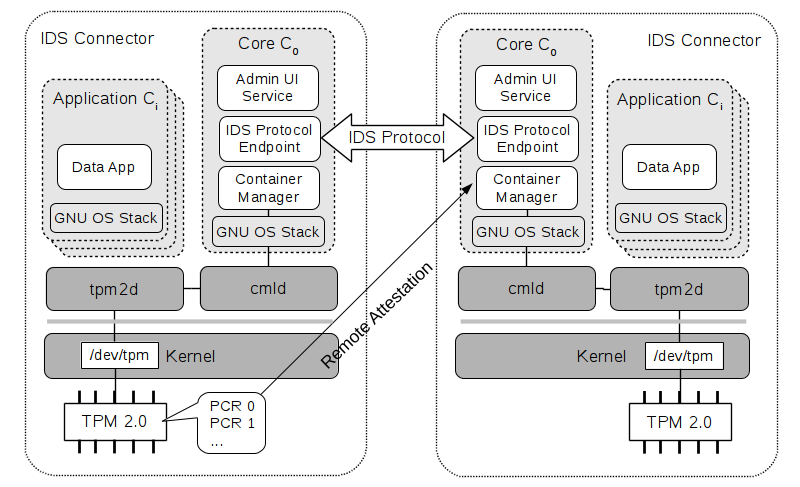

# What is trust|me

trust|me abbreviates "trusted mobile equipment" and is a OS-level virtualization solution for
the Android operating system. It is based on Linux specific features like namespaces, cgroups,
capabilities and LSM to provide isolation of different Android user lands on top of one Linux
kernel. Devices are virtualized either directly in the OS kernel or with a proxy/server in
the Android HAL. The picture below shows the System Architecture of trust|me.
To switch contexts the Power button is virtualized in a special way so that longer presses
triggers a switch to the so called *c0* container which provides a trusted GUI to select one of
the user containers *c1* to *cN*. In the source and workspace structure these are called *a0* to *aN*.

> **Note**: This code repository currently supports the Google Nexus 5X (bullhead) and Nexus 5 (hammerhead) devices only!

A detailed introduction to the used concepts is provided in
[trustme.pdf](doc/trustme.pdf)

# Build and flash trust|me

Currently there is a Android 7.1.2 based branch and ithe old beta Android 5.1.1 based branch
available of trust|me. You can find a howto for getting and compiling the code of trust|me in the
main build repository:

1. beta [trustme_build (trustme-7.1.2_r33-github)](https://github.com/trustm3/trustme_build/tree/trustme-7.1.2_r33-github)
2. old-beta [trustme_build (trustme-5.1.1_r38-github)](https://github.com/trustm3/trustme_build/tree/trustme-5.1.1_r38-github)

# trust|me in the IoT context -> trust|x

> **Note**: The trust|x part is only available for x86 right now!  
> Use [ids-x86-7.1.2-github.xml](ids-x86-7.1.2-github.xml) as manifest to get the IDS related code
> or [ids-x86-5.1.1-github.xml](ids-x86-5.1.1-github.xml) for the former code base

The trust|me code base is also used for our platform reference implementation for an IDS connector.
The [Industrial Data Space (IDS)](http://www.industrialdataspace.org/en/)
provides concepts for a generic shared data cloud in the IoT context.
The following figure shows the generic architecture of trust|x

We reuse only the container management layer of trust|me (ramdisk). The whole Android high level user space stack is
replaced by a generic GNU user space stack. The "business logic" which is not part of this code release is implemented
on a generic JAVA stack inside the GNU containers.

Since on IoT Gateways no user interaction and thus no user authentication is needed, we do not need a
smartcard daemon. However platform auth is required to allow remote connectors to communicate with each other.
For this purpose a TPM 2.0 chip is used. Currently the code base includes a tpm2simulator based on the work
[stwagnr/tpm2simulator] (https://github.com/stwagnr/tpm2simulator).
